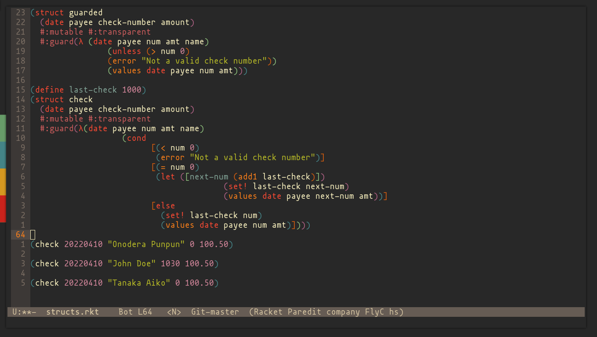

# Pedro's Emacs Dotfiles

My simple and growing emacs config.

Includes support to the following languages:

- Common LISP

- Clojure

- Racket 

Also using evil mode, relative line-numbering, SLIME, paredit and rainbow delimiters.

## Screenshot

